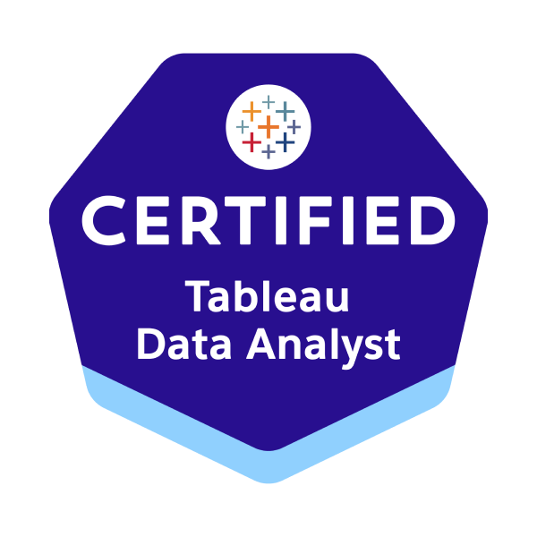
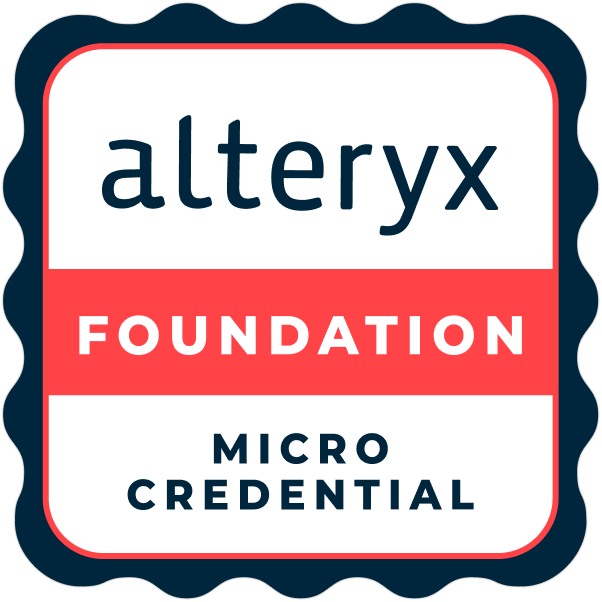
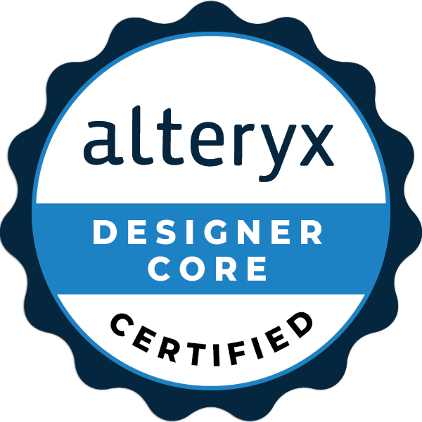
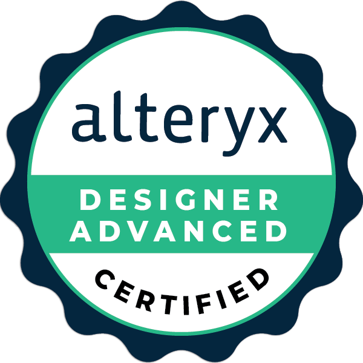
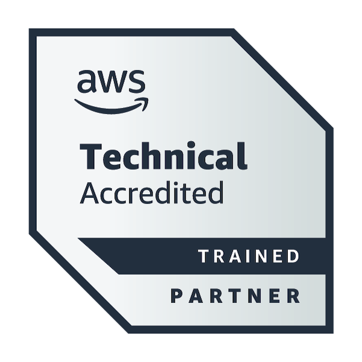

:::::: {#hero-heading}
::: h1
About
:::

Hello! I’m Flavio, a data analytics consultant with a background in engineering and a master’s degree in Innovation and Management in Agribusiness. My analytics journey began at Unilever, where I helped optimize production processes, reducing packaging waste and generating approximately £600k in savings.

I later joined The Information Lab, delivering data solutions across finance, marketing, and operations using Tableau, Alteryx, and SQL. My work includes automating financial reporting, building ETL pipelines for marketing analytics, integrating APIs, and improving dashboard performance.

Alongside consulting, I have trained over 200 professionals in Tableau, Power BI, and Alteryx, while expanding my expertise into cloud platforms (Azure, AWS, GCP) and machine learning applications in agribusiness.

I’m an active member of the data community, recognized as a Tableau Community Highlight and awarded [Viz of the Day](https://public.tableau.com/app/profile/flavio.matos/viz/ThePeriodicTableofWine/periodictableauofwineEN). I have presented at Tableau User Groups in New York, London, Portugal, and Brazil, was nominated for four awards at Tableau Conference 2024, and contribute to pro bono data visualization projects with NGOs, including work showcased at the United Nations Summit in New York.

::: h2
Certifications
:::

::: {.certs-container}
::: {layout-ncol="7"}

:::
:::
::::::