 

How many of you have seen a chart with green for profit, and red for loss? I'm definitely in that group!

The concept is so familiar and widespread that we rarely stop to think (*or want to spend time thinking*) about colour. But colour can be your **greatest ally** or your **worst enemy**.

So, here's a guide that will help you use colour smartly, without spending hours agonising over it.

Let's start with the obvious question:

## Why use colour at all?

The most direct answer is that colours help us identify differences quickly and easily. Our eyes are wired to spot contrasts by colour almost instantly.

So, when a CFO glances at your dashboard, it takes them less than a second to understand whether the result is good or bad, and what action to take next.

A quick (*and fun...* *well, kind of fun*) way to see this in action is to compare how easily you can spot how many number **9s** there are in the image.

Notice how effortless it is to identify 9s through colour contrast, highlighting only the information that matter.

::: {layout-ncol="2"}
{width="350"}

{width="350"}
:::

Great! Now we know **why** it's important. Let's focus on **how** to use it. Here are some best practices that, if you follow them, will put you ahead of 95% of people who just slap red/green on everything.

> ***Quick note:** At the end of this article I'll show you exactly why you should avoid using green/red in your reports.*

 

## 1. Be Consistent

**The first rule of thumb:** be consistent with your colours. If you're building a report showing numbers for Apples and Oranges, stick to the same colours for each category throughout the entire report.

::: {layout-ncol="2"}
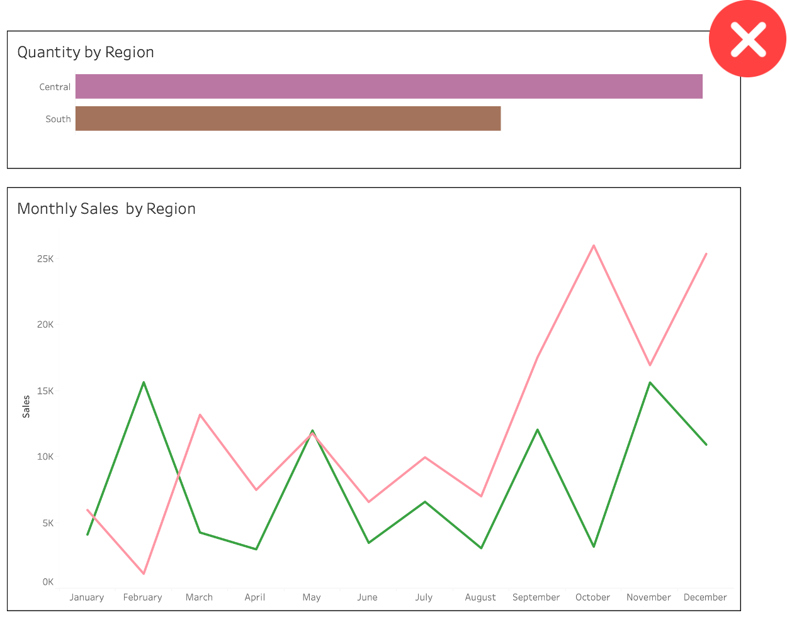{width="350"}

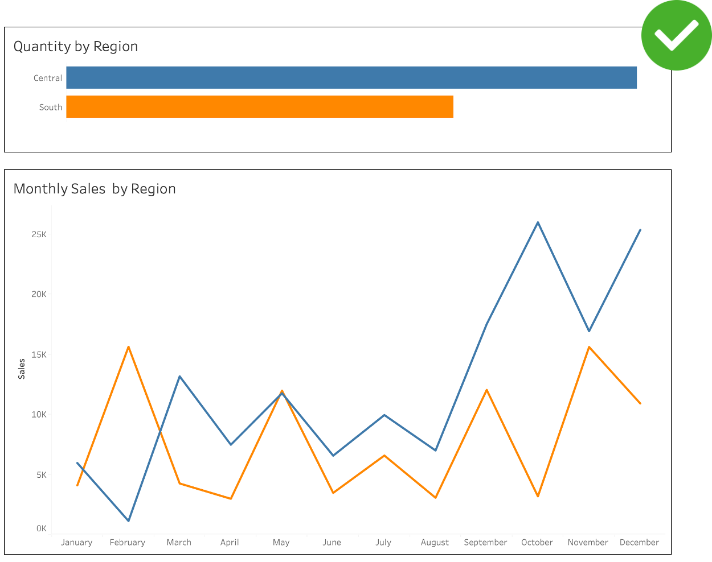{width="350"}
:::

 

## 2. Use Brand Guidelines

You don't need to reinvent the wheel. You can (*and sometimes must*) use brand guidelines and colour palettes. This is a huge time-saver (*a lifesaver too*).

Following a brand's colour palette makes your reports and dashboards feel familiar, gives them a brand identity, and saves you from making an embarrassing mistake.

*I doubt that red means something negative for Coca-Cola, Netflix or China!*

**Starbucks 2026 Annual Report**

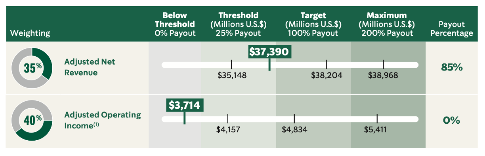{fig-align="left" width="550"}

**Premier League Annual Report 2024/25**

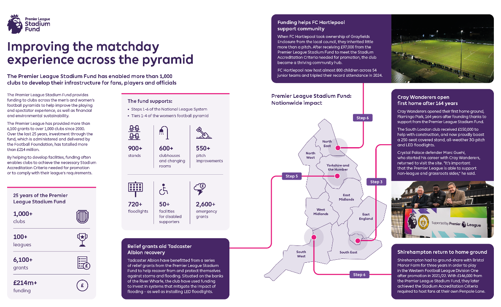{fig-align="left" width="550"}

 

## 3. Use Colours Sparingly... *Unless It's Carnival*

Don't crowd your dashboards with 12+ different colours. Use them sparingly.

The worst data visualisation you can create is one where every value or category gets its own colour. That's just colourful, not insightful.

Colour should guide attention and highlight what matters. Everything else can stay neutral.

::: {layout-ncol="3"}
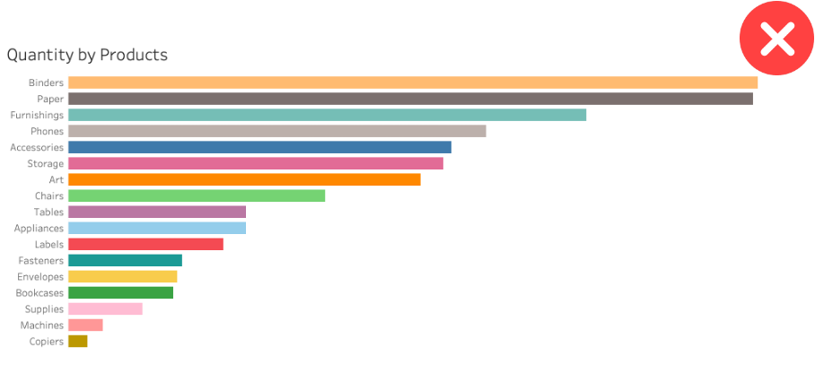{width="450"}

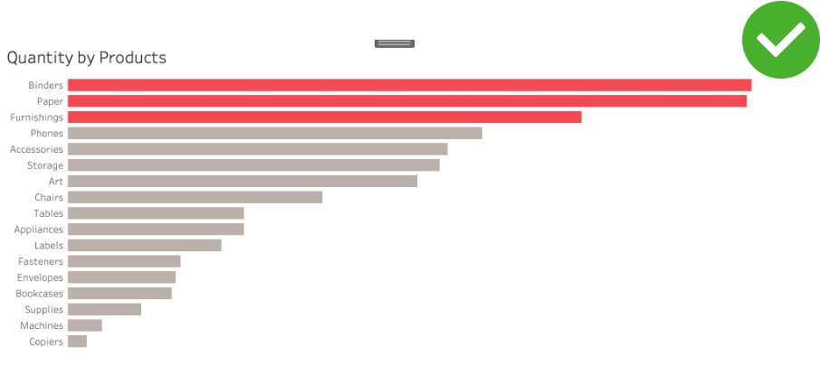{width="450"}

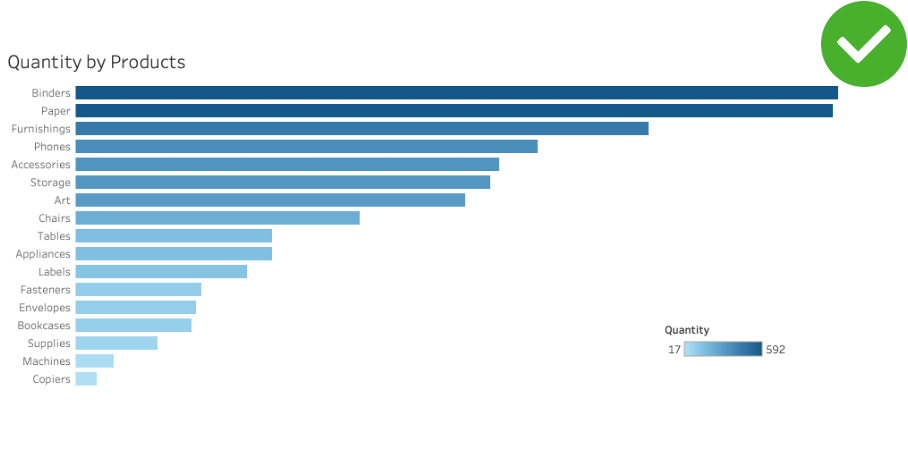{width="450"}
:::

 

## 4. Use Colour with Intention... *But I Hope Your Intentions Are Good*!

This tip is gold, and incredibly powerful. You can take a single chart and tell 3 completely different stories, just by highlighting different elements. Being intentional with colour is a way of telling your audience what matters most.

But, as Uncle Ben told ~~Spider-Man~~ Peter Parker: *with great power comes great responsibility.*

You can draw attention to exactly what you want to emphasize, which also means you can guide your audience toward a particular conclusion. Use that power wisely. You're a data warrior, not a data villain!

In the example below, the authors wanted to draw attention to the fact that 48-month lease units decreased by 36%. However, you can notice that 12-month lease units decreased a bit less, by about 26%, while cash purchases still grew by 10%.

The way you present the data depends on the story you want to tell and what is most relevant to your audience. This should guide where you choose to focus their attention.

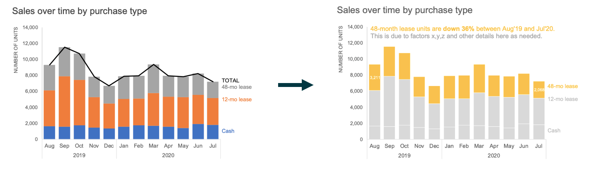{fig-align="center"}

Great! Now you have 4 golden tips to use in your dashboards! Tips that will help you stand out from 95% of other dashboards, save time picking colours, and prove your point by being intentional.

Now let's talk about **what** colours to use.

 

## 5. Colour Palette types

There are essentially 3 types of colour palette you need to know when building your reports: *sequential, divergent,* and *discrete.*

### A. Sequential

Use a sequential colour palette for continuous data, things like temperature, distance, height, weight, and so on. Because the data is continuous, the colours should be too, and we typically use gradients to represent that continuity.

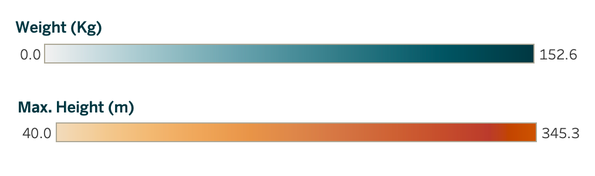{fig-align="center" width="500"}

### B. Divergent

Still within continuous data, divergent palettes work best when you need to show contrast or when there's a meaningful midpoint.

They're great for displaying negative and positive numbers, with zero as the centre or for showing variations around a median.

Temperature (in Celsius) is a classic use case, as is any metric where the middle point is just as meaningful as the extremes.

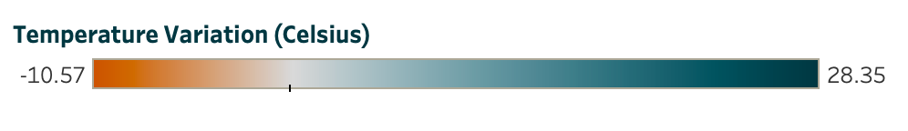{fig-align="center" width="500"}

### C. Discrete

Discrete colour palettes are for categorical data, dimensions and groups that represent fundamentally different things. The goal here is to help your audience immediately see what belongs to what.

Discrete palettes work in almost any chart type: pie charts (each slice gets its own colour), donut charts, bar charts, line charts with multiple series, and even binary cases like achieved/not achieved, true/false, in/out.

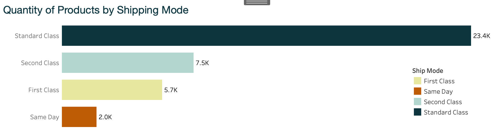

**But wait...**here's the trap! Discrete palettes are incredibly versatile, but this is also where most people forget the *"use colours sparingly"* rule.

When you have more than 6 categories and assign a different colour to each one, your dashboard starts to look like a Carnival poster or a painting from MoMA.

You do **not** want to be that person.\
You do **not** want to be that person. *(I wrote that twice so it really sinks in).*

*Ok, but, what if I'm building a chart with all the countries in the world, nearly 200 of them?* Great question!

You can easily group them: by the 5 continents, OECD membership, BRICS, or any other meaningful grouping. Here is an examples of using discrete colours sparingly even with many dimensions:

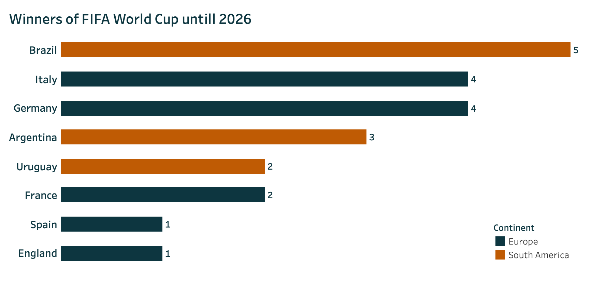

 

## One Last Thing: Accessibility

Now you know everything about colour palettes, but before you head to LinkedIn to announce that you're the Van Gogh of dataviz, we need to talk about accessibility.

When building reports and dashboards, you need to ensure that **everyone** can access your data and read your insights.

That means choosing colours that are colour-blind friendly, where the contrast between colours is still clear to people with colour vision deficiencies. And yes, **this is exactly why you should stop using green/red.**

::: {layout-ncol="2"}
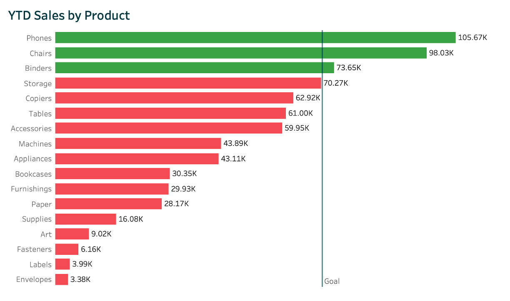{width="500"}

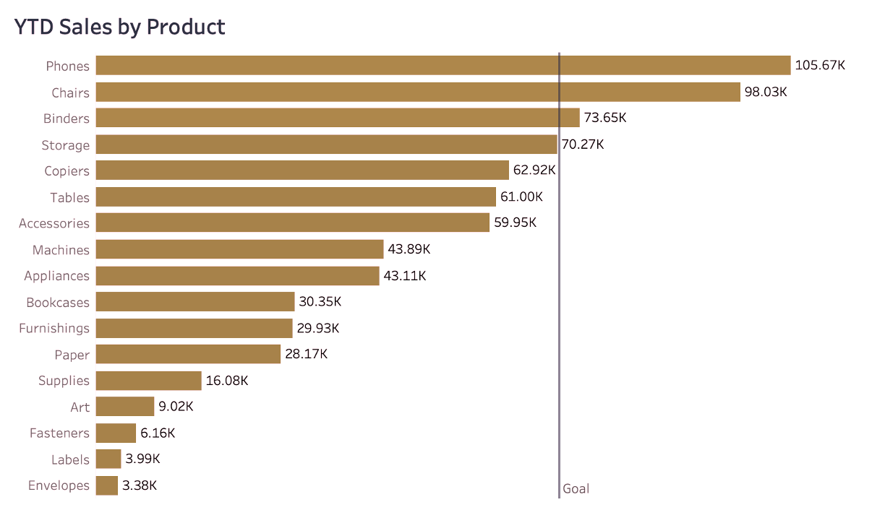{width="500"}
:::

::: text-center
*Example of how someone with colour blindness (deuteranopia) would see the chart using red and green colours.*
:::

Tableau has a colour-blind friendly palette built in, but you can also check your own palette using these free tools:

- [Pilestone](https://pilestone.com/pages/color-blindness-simulator?srsltid=AfmBOoqoYI2tNAjTEmMj3WokLroCtd2IA0G-C7D_mXaJVa5DALTEaadh)

- [Color Oracle](https://colororacle.org)

- [RGBlind](https://rgblind.com)

- [Coblis](https://www.color-blindness.com/coblis-color-blindness-simulator/)

Building your dashboards with your audience in mind not only makes you more intentional with colour choices, it also helps your ideas reach more people.

More people will be able to see your insights and contribute to the conversation.

 

## Steal like an artist! - *Resources and References*

Looking for colour palette inspiration? Here are some great places to start:

**Brand's website and annual reports**\
Big companies pay agencies millions to craft their colour guidelines, and you can use those for free.\
No need to reinvent the wheel.

**Pinterest and Google Images**\
Try searching for a product category (*like laundry detergents*) and notice how the results are dominated by blues and light blues.

We're already subconsciously familiar with colour associations, and you can leverage that to add context to your dataviz.

**The real world**\
Go outside! Take a walk around the block. Notice the colours around you in everyday life.\
You'll find that everything follows a colour pattern. Feel free to *get inspired* *.*

**The Adobe Colour Wheel**\
If you want to create your own palette from scratch, [Adobe's Colour Wheel](https://color.adobe.com/create/color-wheel) helps you pick combinations that actually work together, based on colour theory.

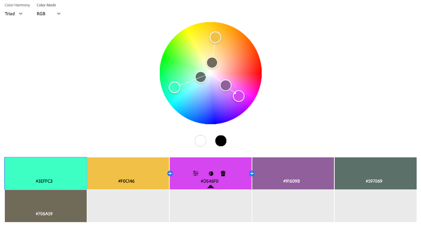{fig-align="center" width="500"}

Adobe also has a fantastic tool that extracts a colour theme directly from an image. If you want to use a painting (*say, a Van Gogh*) but aren't sure which colours dominate or what the hex codes are, this tool does the work for you. I strongly recommend giving it a try.

## Conclusion

So now you know how to use colour in your data visualisations.

You won't waste hours on it anymore, because you know there are plenty of ready-to-go references ~~to steal~~ out there, and you know the best practices to follow to make sure your dashboards look polished (*not like a primary school art project*).

Go build your next dataviz! But keep this article handy to double-check you're following all the tips. Your audience will thank you for it.

And most importantly...please, **stop using green and red. For good.**

------------------------------------------------------------------------

### 📱Social media

You can find me on [LinkedIn](https://www.linkedin.com/in/flavio-matos/) and [Twitter](https://twitter.com/flaviomatos_uk)

Check out my portfolio on [Tableau Public](https://public.tableau.com/app/profile/flavio.matos)