  Connecting **Tableau Server** with **Slack** can transform the way you and your team work, making it easier to share information and collaborate directly within Slack.

Some of the benefits of this integration include:

*•* **Setup Alerts:** Monitor KPIs directly in Slack.

*•* **Real-Time Collaboration:** Share insights for instant discussion.

*•* **Faster Decision-Making:** Access critical data without even opening Tableau Server.

 

> To configure the integration between **Tableau Server** and **Slack**, you must have administrator permissions on both platforms.

 

Before starting this tutorial, it is important to remember that connecting Tableau Server to Slack requires **creating a Slack application** first. It may seem complicated, but by following the step-by-step instructions below, you will see that it is quite simple.

 

## How to Create a Slack App

**1.** Go to the [Slack API documentation](https://api.slack.com/apps), click **Create New App**, and select the **From Scratch** option.

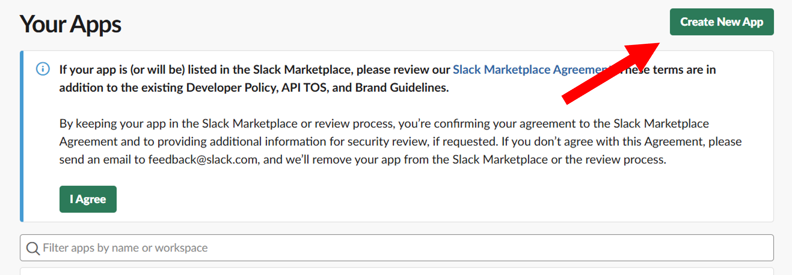{fig-align="center" width="500"}

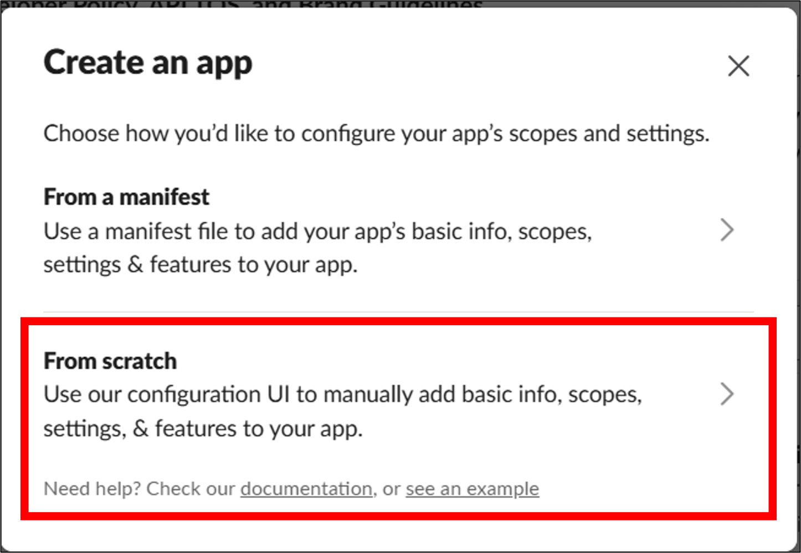{fig-align="center" width="500"}

\
**2.** Choose a **name** for the app, select a **workspace**, and click **Create App**.

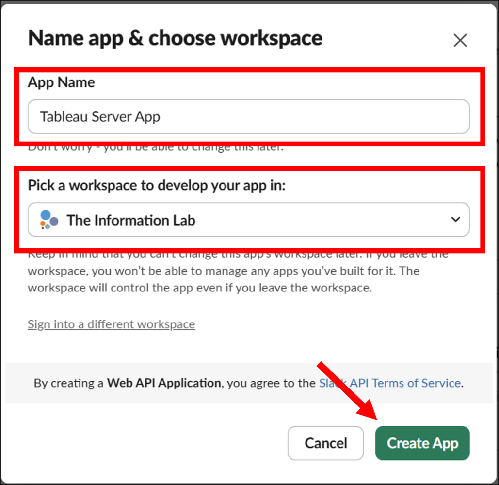{fig-align="center" width="500"}

\
**3.** In the side menu, go to **App Home** and click **Review Scopes to Add.**

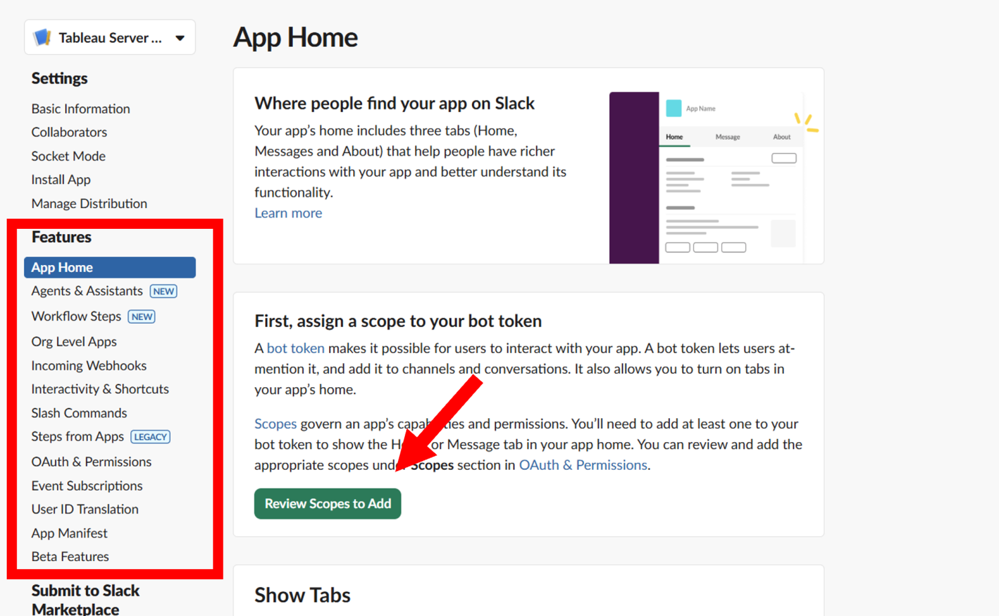{fig-align="center" width="500"}

\
**4.** Scroll down to the **Scopes** section and, under **Bot Token Scopes**, click **Add an OAuth Scope**. Then select the following permissions:\
   **• chat:write\
   • files:write\
   • users:read\
   • users:read.email**\

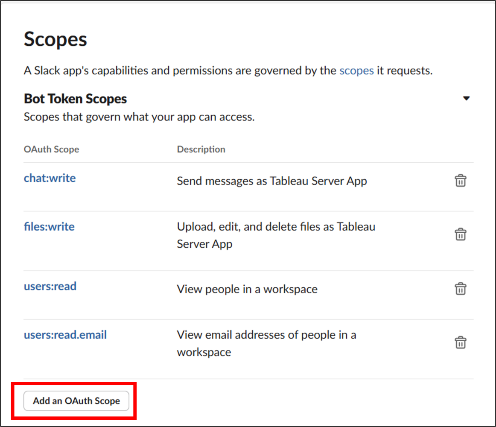{fig-align="center" width="500"}

\
**5.** In the side menu, select **OAuth & Permissions** and scroll down to the **Redirect URL** section.\
   Click **Add New Redirect URL** and enter the URL of the Tableau Server you want to connect, using the following format: **https://**\<Tableau Server URL\>**/auth/add_oauth_token**

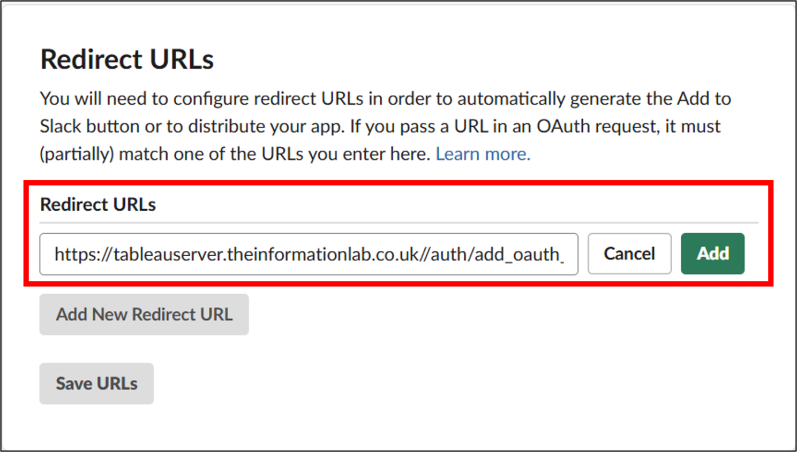{fig-align="center" width="500"}

\
**6.** Select **Basic Information** from the side menu and copy or save the following details:\
   • Client ID\
   • Client Secret\
   • Redirect URL entered in the previous step\
\
⚠️ **You will need this information shortly**.

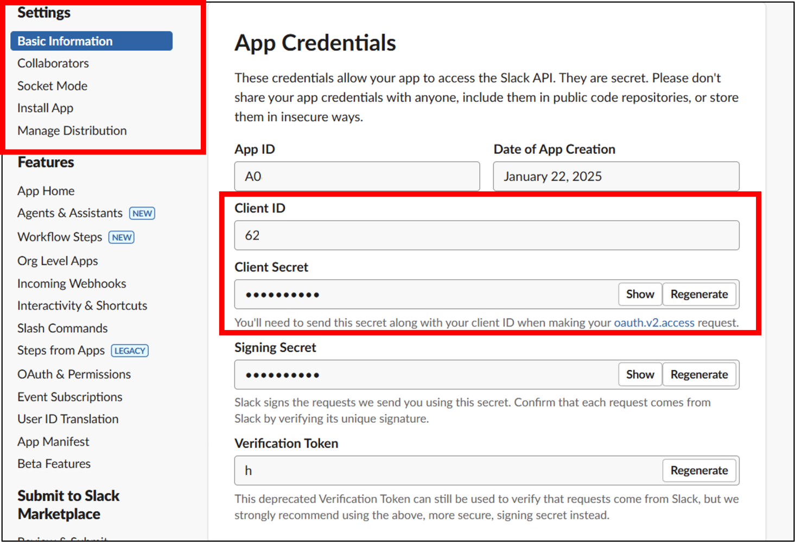{fig-align="center" width="500"}

\
**7.** Click **Install App** and then the green **Install to \<Your Workspace\>** button.\
Slack will ask for permission to allow the app to access your company workspace. If you agree, click **Allow**.\

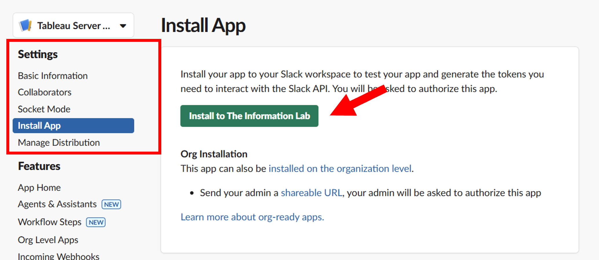{fig-align="center" width="500"}

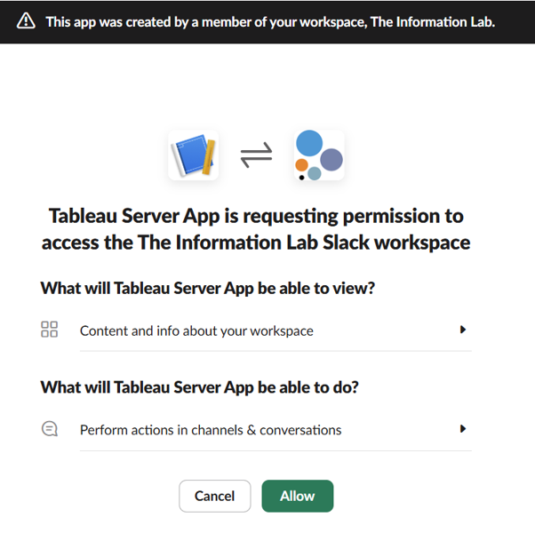{fig-align="center" width="500"}

\
Done! You will see a message confirming that the app has been installed successfully.\

Now we need to connect Tableau Server to the app we just created.

 

## **Connecting Tableau Server to Slack**

\
1. In **Tableau Server**, click **Settings** in the side menu and then select the **Integrations** tab.

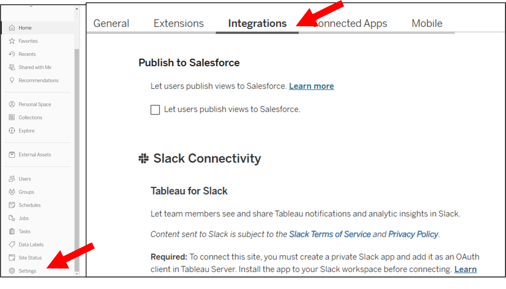{fig-align="center" width="500"}

\
2. Under **Slack Connectivity**, click **Add OAuth Client** and enter the information you copied in step 6:\
   **•** Client ID\
   **•** Client Secret\
   **•** Redirect URL\
\
Then click **Add OAuth Client**.

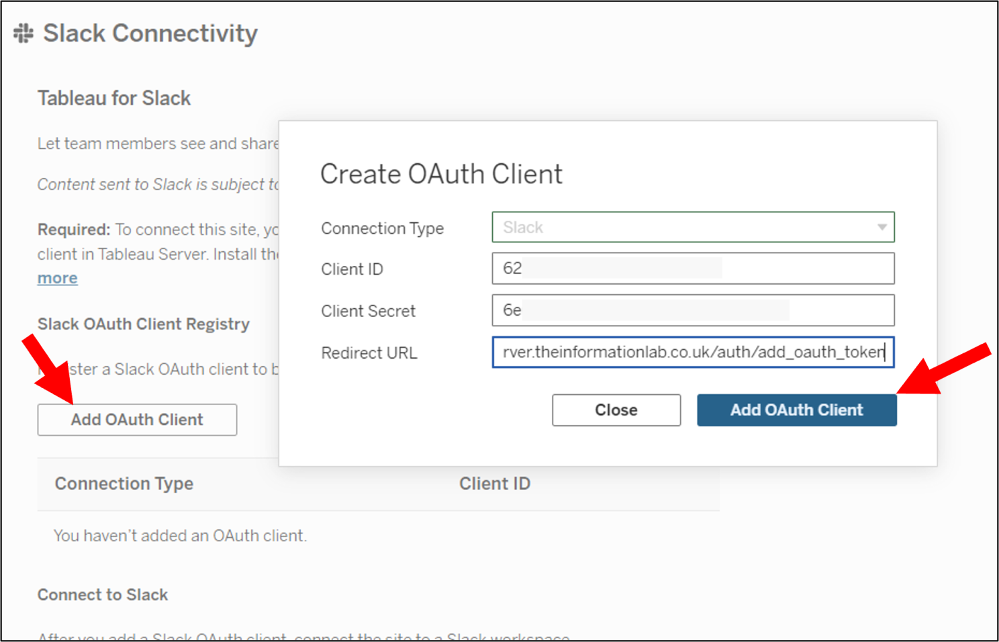{fig-align="center" width="500"}

\
3. You will see the **Connection Type** and **Client ID** listed in the table below. Click **Connect to Slack**.\
\
A new window will appear asking you to approve the permissions required to connect Tableau Server to Slack. If you agree, click **Allow**.

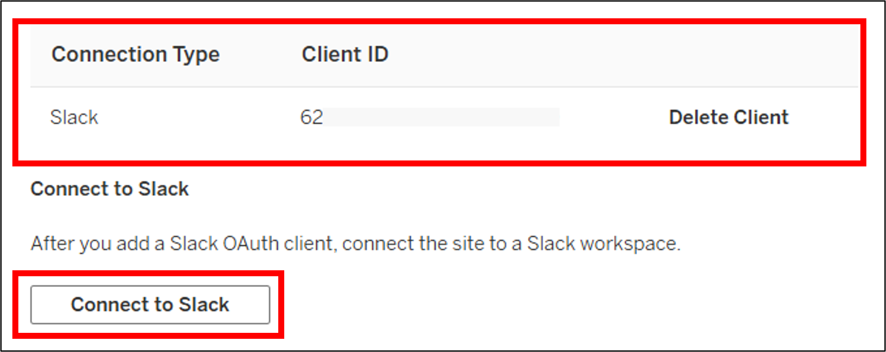{fig-align="center" width="500"}

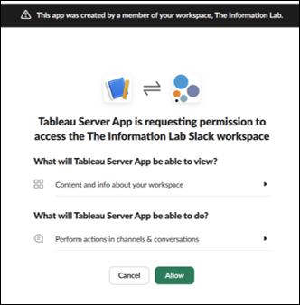{fig-align="center" width="500"}

Done! Your **Tableau Slack App** is now created and connected to **Tableau Server**.

 

## **Bonus: Testing the Integration**

\
1. Open **Slack**, click **Add Apps**, and select the app we just created (in this example, **Tableau Server App**).

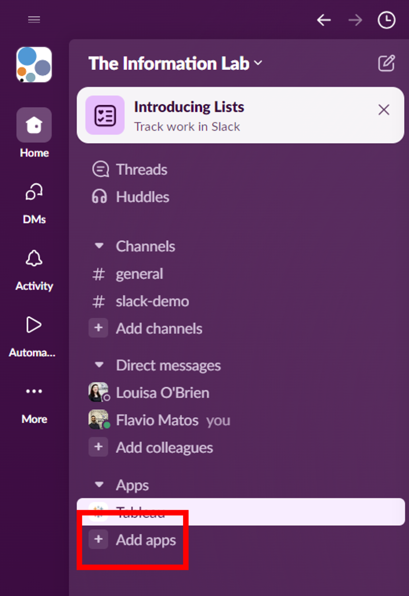{fig-align="center" width="500"}

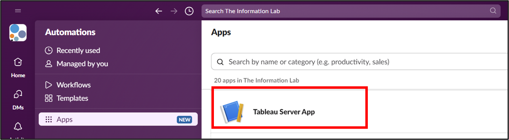{fig-align="center" width="500"}

\
2. To test the integration, open any view in **Tableau Server** and click **Share**.

Select yourself as the recipient and add a message (optional).\
\
⚠️ **Important: The email address used in Tableau Server must be the same as the one registered in Slack.**

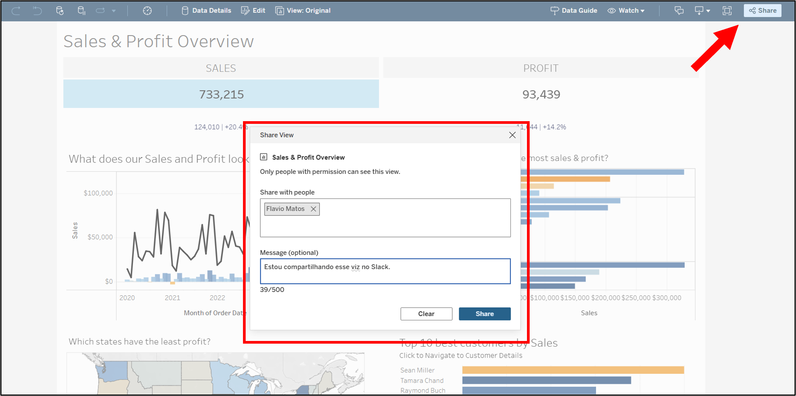{fig-align="center" width="500"}

\
3\. You will receive a Slack notification informing you that you have a message from the Tableau App.

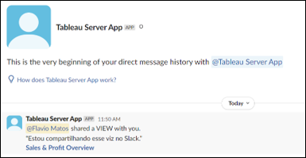{fig-align="center" width="500"}

And that concludes our tutorial on how to integrate **Tableau Server** with **Slack**!\
\
I hope you found this guide useful. Let me know in the comments if it worked for you, and if you have any questions, feel free to leave a comment!\

---

### 📱Social media

You can find me on [LinkedIn](https://www.linkedin.com/in/flavio-matos/) and [Twitter](https://twitter.com/flaviomatos_uk)

Check out my portfolio on [Tableau Public](https://public.tableau.com/app/profile/flavio.matos)