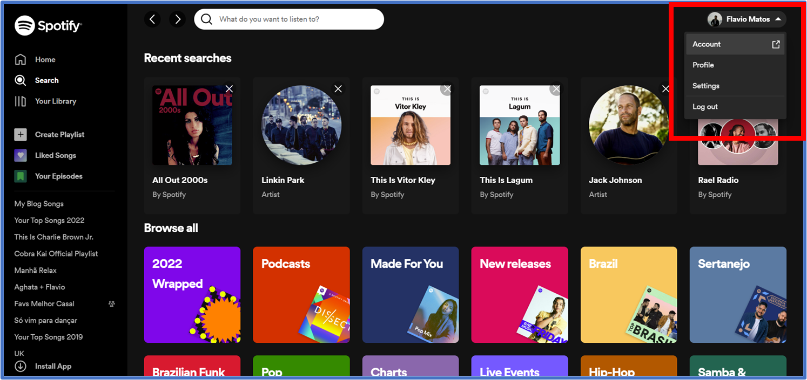
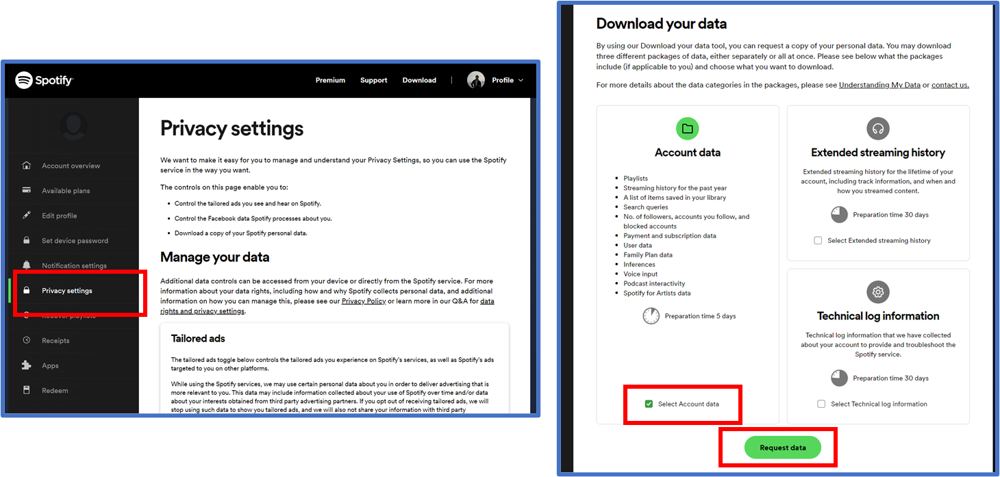
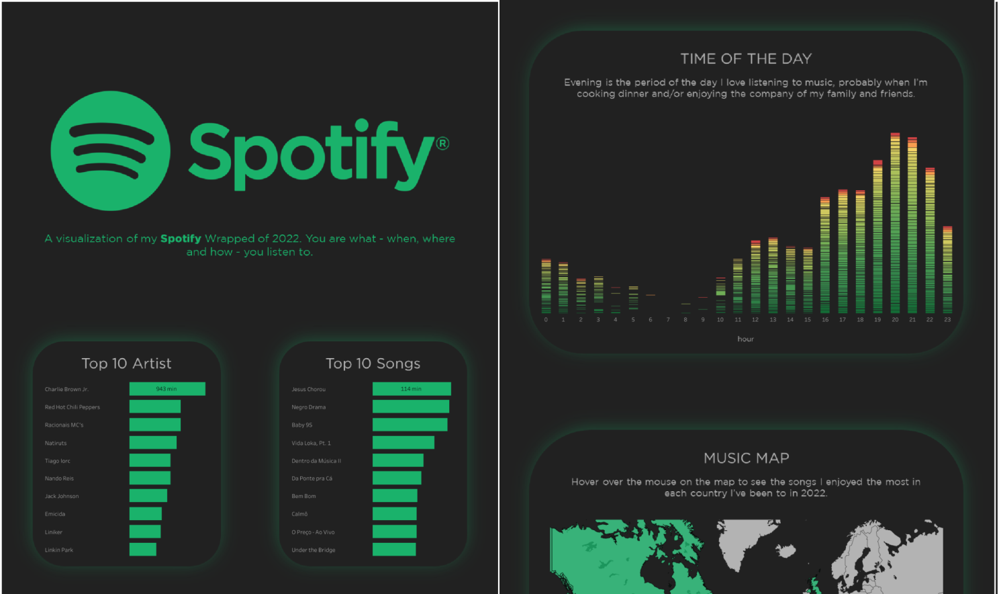

 

Music is a daily part of many of our lives. Wouldn’t it be cool if you could see what your music said about you this year? You don’t have to wait for your music streaming service to provide that for you anymore.

You can see and learn from your listening data at any point in the year using **Tableau** *- how cool is that?*

I've found some tutorials teaching how to get your data from **Spotify** using API. To be honest, I found that a bit difficult and started to look for some work-around.

Fortunately, there is an easy way to get your data and I will share with you these 3 easy steps.

## Step 1. Access your Spotify Account

First, open up [open.spotify.com](http://open.spotify.com/) in your web browser. Click on your name in the top right corner and then click on **“Account.”**

## Step 2. Request your data

Now, navigate to the left side of the page and click on “**Privacy Settings**.” Scroll down to the section “**Download Your Data**” and look toward “**Account Data**.” Make sure to check the box next to “**Select Account data**”, scroll down to the bottom of the page and click “**Request Data**.”

## Step 3. Verify your email

Now you just need to verify your data request via your email inbox. After confirming, you should receive your account data from the previous year within the next 5 days*.*

That's it! You did it! Now it's your time to make an amazing viz that tells the story of ***your*** year and found insights that matter to you.

Share you viz with your friends and don't forget to tag me. I'll be happy to see your viz.

You can check my Spotify viz [here](https://www.thedataschool.co.uk/flavio-matos/my-spotify-wrapped-of-2022) in this post and also in my [Tableau Public](https://public.tableau.com/app/profile/flavio.matos?ref=thedataschool.co.uk).

------------------------------------------------------------------------

### 📱Social media

You can find me on [LinkedIn](https://www.linkedin.com/in/flavio-matos/) and [Twitter](https://twitter.com/flaviomatos_uk)

Check out my portfolio on [Tableau Public](https://public.tableau.com/app/profile/flavio.matos)