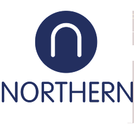

:::: {#hero-heading}
### DATA ANALYTICS CONSULTANT · 15+ CLIENTS · 8 INDUSTRIES

# Turning complex data into answers that drive business decisions

Building data solutions aligned with your business goals.

::: hero-icons






:::

<a href="contact.qmd" 
class="button"> Contact Me </a>
::::

:::: clients-band
## Organizations I've worked with

::: {.clients-logos layout-ncol="8"}

 

 

 

:::
::::

::: section-intro
## How I help organizations turn data into decisions
:::

:::::: {.grid .services-grid}
::: {.g-col-12 .g-col-lg-4 .service-card}


### Data Engineering

Design reliable data pipelines, transform raw data into structured
datasets, and create scalable foundations for analytics.
:::

::: {.g-col-12 .g-col-lg-4 .service-card}


### Analytics & Modeling

Use statistical models and exploratory analysis to uncover patterns,
measure performance, and support strategic decisions.
:::

::: {.g-col-12 .g-col-lg-4 .service-card}


### Dashboards & BI

Build clear and actionable dashboards in Tableau or Power BI that turn
complex data into accessible insights.
:::
::::::

::: {.lately-section}

## Latest work

:::: {.grid}

::: {.g-col-4}

#### Projects
::: {#projects}
:::

[See all →](portfolio.qmd){.about-links}

:::

::: {.g-col-4}

#### Talks
::: {#talks}
:::

[See all →](talks.qmd){.about-links}

:::

::: {.g-col-4}

#### Blog
::: {#blog}
:::

[See all →](blog.qmd){.about-links}

:::

::::

:::